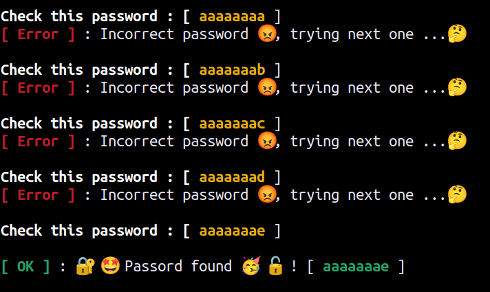

# Wifi Cracker📡📶🔓

Crack a wifi by <b>Brut-force</b> method.


## Description
<ul>
    <li> <em><b>charset.lst</b></em> file contains list of caracters in present in wifi password
    <li> <em><b>crack_wifi.sh</b></em> is the main file to be execute
</ul>

## Pre-requise
1.  Use <b>GNU/Linux</b> Debian OS family.
2.  Install the <b>crunch</b> with `sudo apt install crunch`
3.  Execute `chmod +x /path/to/script/crack_wifi.sh`
4.  (optional) Copy the script to path `cp /path/to/script/crack_wifi.sh /usr/bin`

## How to use ?

```
crunch min max -f shcharset.lst pass | crack_wifi.sh SSID Wait_Time 
```
